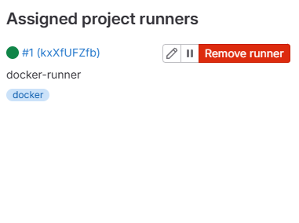

# Домашнее задание к занятию «GitLab»
**Ларионов Александр**

---

## Задание 1

### Решение
Развёрнут GitLab локально через Vagrant (репозиторий `netology-code/sdvps-materials`, папка `gitlab`).
Создан проект `gitlab-hw`, зарегистрирован GitLab Runner в режиме Docker.



---

## Задание 2

### Решение
Репозиторий запушен в GitLab (`http://192.168.56.10/root/gitlab-hw`).
Создан `.gitlab-ci.yml` с этапами `test` и `build`.

### Код `.gitlab-ci.yml`
```yaml
stages:
  - test
  - build

test:
  stage: test
  image: alpine:latest
  tags:
    - docker
  script:
    - echo "Running tests..."
    - echo "OK"

build:
  stage: build
  image: alpine:latest
  tags:
    - docker
  script:
    - echo "Building project..."
    - echo "OK"